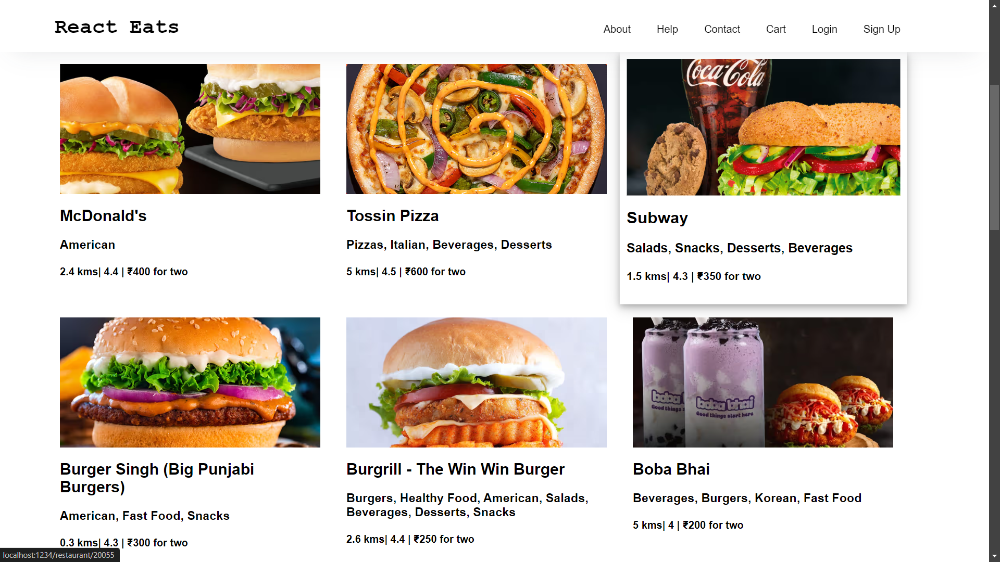

Stage 1. Created app layout and composed initial wireframe design, keeping design and GUI part to bare minimum and clean.

Stage 2. Used Cdn images, staged the initial reusable components followed scalable design and modular design architecture for SPA's.

Stage 3. Mocked Swiggy's public api and updated the codebase using dynamic component rendering.
(Data driven UI -> getting rid of static UI for flexibility and rich UX), error handling.

Stage 4. Integrated Swiggy's api and react-router-dom as per SPA's architecture, to fetch real time data for pooling in restaurants list and other relevant data.

Stage 5. Added menu component, dynamic routing (added other router components used) 
Used createBrowserRouter, RouterProvider, Outlet to effectively implement the routing and resolved conflicts due to routing and fixed minor issues.

Stage 6: Class based components exp + string manipulation of cuisines array in Swiggy's real time API(i.e: data processing for UI), adjusted some deep level nesting of the API for UI error handling. 
React Link tag handling -> minor fixes, planning integration of Tailwind and store into project for testing purposes.

