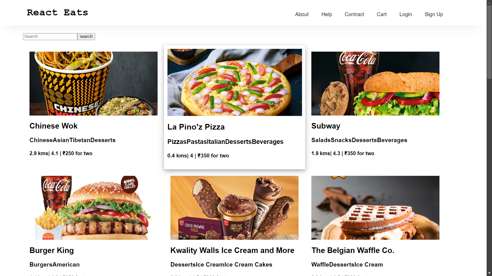
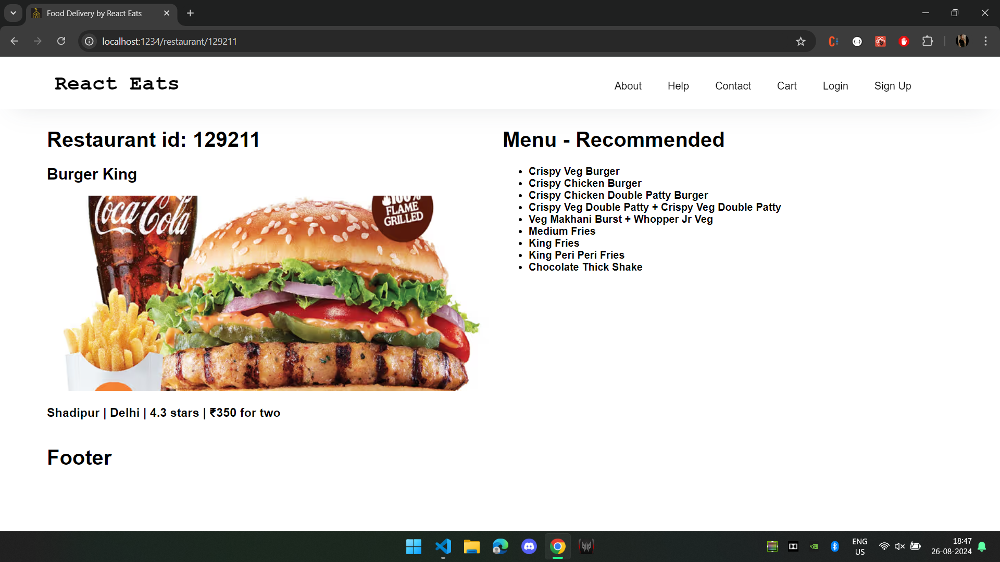

Stage 1. Created app layout and composed initial wireframe design

Stage 2. Used Cdn images, staged the initial reusable components followed scalable design and modular design architecture for SPA's

Stage 3. Mocked Swiggy's public api and updated the codebase using dynamic component rendering, error handling

Stage 4. Integrated Swiggy's api and react-router-dom as per SPA's architecture 

Stage 5. Added menu component, dynamic routing and resolved conflicts due to routing and fixed minor css 

